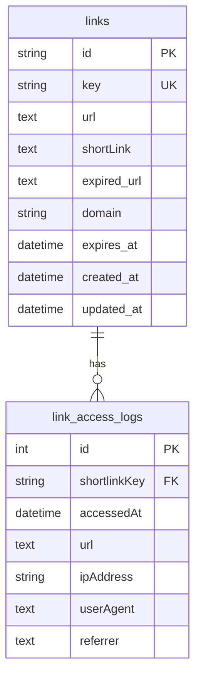

# Shortify


## Table of Contents

1. [Getting Started](#getting-started)
2. [Apps and Packages](#apps-and-packages)
2. [Tests](#tests)
3. [ERD](#erd)

## Getting Started

### Prerequisites

- Node.js (v20 or higher)
- Docker and Docker Compose
- pnpm

### Installation

1. **Clone the repository**:
   ```bash
   git clone http
   cd shortify
   ```

2. **Install dependencies**:
   ```bash
   pnpm i
   ```

### Running the Application

1. **Start the application and services**:
   ```bash
   docker compose up -d
   ```

The application will now be running at http://localhost:3006

## Apps and Packages

- `web`: a [Next.js](https://nextjs.org/) app
- `ms-api`: a Nest.js microservice to create links and generate reports
- `ms-redirect`: a Nest.js microservice to redirect links
- `@shortify/ui`: a stub React component library shared by `web` application
- `@shortify/core`: a package to manage entity of application
- `@shortify/drizzle-orm-mysql`: a module in Nestjs of drizzle orm to use in ms-api or ms-redirect
- `@shortify/utils`: a package with functions utils
- `@shortify/eslint-config`: `eslint` configurations using AntFu
- `@shortify/typescript-config`: `tsconfig.json`s used throughout the monorepo

## Tests

The test implementation follows best practices including:
- Clear Arrange/Act/Assert structure
- Mocking of dependencies
- Clear test naming and organization

You can run the tests using the npm scripts defined in package.json:
- `pnpm run test:unit` - Run unit tests
- `npm run test:e2e` - Run end-to-end tests

## ERD

The following is the Entity-Relationship Diagram (ERD) for the application:



## Screenshot


